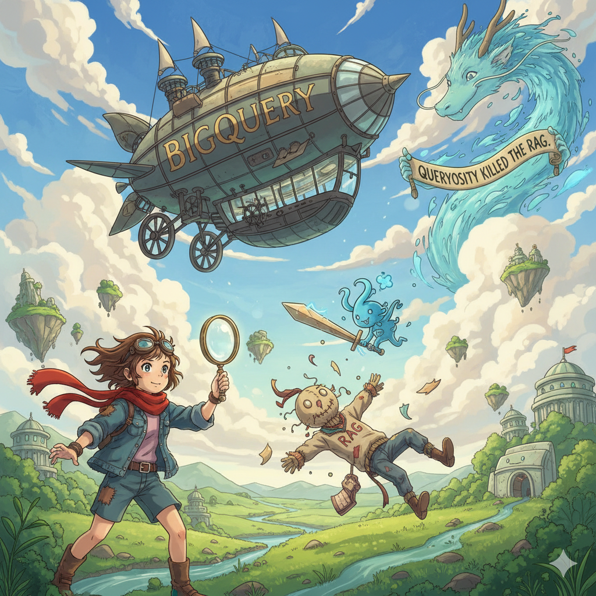
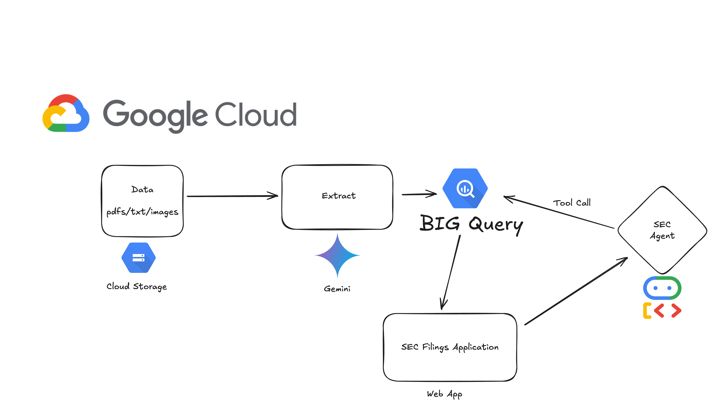

# Queryosity Killed the RAG

<div align="center">
  
</div>

## 🚀 Smarter Enterprise Search with BigQuery

A full-stack application for BQ Competition 2025 featuring AI agents (Google-ADK), React frontend, and BigQuery Storage and AI for SEC filings analysis and contract processing.

This solution, built entirely on BigQuery and Google Cloud, reduces the time it takes to find, filter, and understand enterprise documents. Instead of treating each document as a blob of text, we parse and enrich files into a semi-structured schema: agreement type, key entities (company, parties), dates, jurisdiction, a summary of the document.

This allows documents to be queried directly with SQL, joined with existing enterprise datasets. For complex questions, we seamlessly layer in AI.GENERATE , AI.GENERATE_TABLE and AI.GENERATE_BOOL, with OBJECTREFs enabling tasks like sentiment analysis, clause filtering, and any AI parsing we have, all without leaving BigQuery.

### 🎯 Example Use Case
**Query**: *"Get me all the loan agreements of Tesla and derive their interest rates."*

1. 🔍 Gets documents where `company_name` is like '%Tesla%'
2. 🤖 Uses `AI.GENERATE` to extract interest rates using `OBJECTREF`

<div align="center">
  
  <p><em>Solution Overview - From Unstructured Data Silos -> BigQuery Powered Search</em></p>
</div>

### 🌟 Impact
The impact is broad: 
- **Legal teams** can instantly locate contracts with specific obligations
- **Compliance teams** can track renewal clauses
- **HR teams** can search employment agreements  
- **Finance teams** can analyze obligations across invoices

In short, any enterprise with unstructured data can connect their storage to BigQuery and immediately turn it into a structured knowledge base.

Anyone who is a part of the organization can use BigQuery, without being skilled in actually writing queries.

> **💡 BigQuery is the engine, Agent is our waymo, we just tell it what to search.**

## 📋 Overview

<div align="center">
  
  <p><em>System Architecture Overview</em></p>
</div>

This project analyzes SEC contract data using BigQuery's AI/ML capabilities to transform unstructured contract documents into structured, queryable insights. Which includes ObjectRefs to enable AI Functions on the Fly.

## ✨ Key Features

- 🔍 **Intelligent Document Processing**: Parse contracts into structured data using Gemini AI
- 🗄️ **BigQuery Native**: Store and query documents directly in BigQuery with SQL
- 🤖 **AI-Powered Analysis**: Leverage `AI.GENERATE`, `AI.GENERATE_TABLE`, and `AI.GENERATE_BOOL` functions
- 🔗 **ObjectRef Integration**: Enable multimodal analysis and on-the-fly AI processing
- 🌐 **Interactive Web Interface**: Chat-based interface for natural language querying
- 📊 **Real-time Analytics**: Join document data with existing enterprise datasets
- 🚀 **Scalable Architecture**: Built on Google Cloud for enterprise-scale processing 

### 📊 Dataset

The project uses the [Material Contract Corpus](https://mcc.law.stanford.edu/download/contracts/) from Stanford University - a comprehensive dataset containing over 1M contract documents from 2000-2023, with a focus on 2020-2023 data (130k+ documents). The dataset has been uploaded to Google Cloud Storage for processing.

### 🔄 Data Processing Pipeline

1. **📥 Ingestion** (`src/ingestion/`): Contract documents with a subset of 2020/Q1 documents were processed using Google's Gemini AI to extract structured data including company names, contract types, governing law, parties involved, and key clauses.
   - `extraction.py`: Main extraction script that processes files from Google Cloud Storage
   - `contract_schema.py`: Defines the Pydantic models and BigQuery schema for extracted contract data

2. **🗄️ BigQuery Storage**: Extracted data is stored in BigQuery tables with a comprehensive schema supporting advanced analytics and AI-powered querying.

3. **🤖 AI/ML Integration**: The system leverages BigQuery's built-in AI functions (`AI.GENERATE`, `AI.GENERATE_TABLE`) for intelligent contract analysis and natural language querying.
   - `notebooks/BQ-MCC-EXPLORATION.ipynb`: Exploration on how to use BigQuery AI/ML capabilities
   - `notebooks/objectRef.ipynb`: Shows how to include multimodal analysis with BigQuery object referencing and AI/ML integration

## 🏗️ Components

### 📓 Notebooks
Interactive Jupyter notebooks demonstrating BigQuery AI/ML capabilities:
- `BQ-MCC-EXPLORATION.ipynb`: Explores the Material Contract Corpus data and BigQuery AI/ML features
- `objectRef.ipynb`: Advanced BigQuery object referencing and AI/ML integration examples

### 🤖 Agents
Python-based agents for intelligent contract analysis:
- `main.py`: FAST API app which exposes SEC Agent that queries BigQuery data using AI/ML functions and BigQuery Toolset

### 🌐 Web App
React-based frontend for interacting with AI agents:

<div align="center">
  
  <p><em>Document Querying Interface</em></p>
</div>

<div align="center">
  
  <p><em>AI-Powered Table Generation</em></p>
</div>

Key components:
- `src/components/ChatMessage.tsx`: Chat message display component
- `src/services/chatApi.ts`: API service for communicating with backend agents

## 🛠️ Installation

This project uses [uv](https://github.com/astral-sh/uv) for fast Python package management.

### Prerequisites
- Install uv: `curl -LsSf https://astral.sh/uv/install.sh | sh`

### Setup
```bash
# Create virtual environment and install dependencies
uv sync

# Activate the virtual environment
source .venv/bin/activate  # On Unix/macOS
# or
.venv\Scripts\activate     # On Windows
```

### Development Setup
```bash
# Install development dependencies
uv sync --group dev

# Install documentation dependencies
uv sync --group docs
```

## 🚀 Usage

Add your Google Cloud credentials and API keys to a `.env` file:

```env
GOOGLE_CLOUD_PROJECT=your-project-id
GOOGLE_APPLICATION_CREDENTIALS=path/to/service-account.json
GOOGLE_CLOUD_LOCATION='your-project-location'
```

## 📁 Project Structure

```
├── agents/
│   ├── main.py
│   └── sec-filings/
│       ├── agent.py
│       └── prompts/
│           └── root_agent_prompt.py
├── app/
│   ├── src/
│   │   ├── components/
│   │   │   ├── ChatContainer.tsx
│   │   │   ├── ChatInput.tsx
│   │   │   └── ChatMessage.tsx
│   │   ├── services/
│   │   │   └── chatApi.ts
│   │   ├── types/
│   │   │   └── chat.ts
│   │   ├── App.tsx
│   │   ├── main.tsx
│   │   └── index.css
│   ├── package.json
│   ├── vite.config.ts
│   └── tailwind.config.js
├── notebooks/
│   ├── BQ-MCC-EXPLORATION.ipynb
│   ├── ObjectRef.ipynb
│   └── examples/
│       ├── analyze_multimodal_data_bigquery.ipynb
│       └── bigquery_generative_ai_intro.ipynb
├── src/
│   └── ingestion/
│       ├── extraction.py
│       ├── contract_schema.py
│    
├── pyproject.toml
├── uv.lock
└── README.md
```
